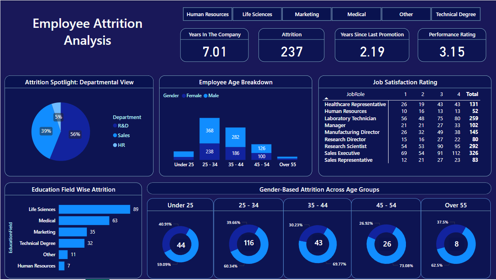

# 🏢 Employee-Attrition-Analysis

🚀 **Power BI dashboard analyzing employee attrition trends using HR dataset from Kaggle.**  

---

## 📊 HR Employee Attrition Analysis Dashboard

## 📌 Project Overview
Employee attrition is a critical challenge for organizations. This dashboard provides insights into attrition trends based on different factors like department, job satisfaction, age, and education fields.

### **Key Features**
✅ **Attrition Breakdown**: Department-wise and Age-wise analysis.  
✅ **Job Satisfaction Trends**: Based on different job roles.  
✅ **Years in Company & Last Promotion**: Key indicators affecting attrition.  
✅ **Education-wise Attrition Rates**: Understanding which fields have higher attrition.  

---

## 📂 Dataset Information
- **Source**: Kaggle HR Dataset
- **Size**: 240KB
- **Features**:
  - Employee Age
  - Job Role
  - Department
  - Education Field
  - Job Satisfaction
  - Years in Company

---

## 🎯 How to Use
1. **Download and Open the Power BI File** (`HR Dashboard.pbix`)
2. **Connect to the Dataset** (`HR dataset.xlsx`)
3. **Explore the Interactive Dashboard**

---

## 📥 Installation & Requirements
- **Power BI**: Download from [Microsoft](https://powerbi.microsoft.com/)

---

## 👥 Contribution
Contributions are welcome! Feel free to:
- Open an **issue** 📌
- Create a **pull request** 🔥

---

## 📧 Contact
For any queries, reach out via:  
📩 Email: [dhritiwahi96@gmail.com]
🔗 LinkedIn: [https://www.linkedin.com/in/dhritiwahi/] 

---

⭐ **If you like this project, give it a star!** ⭐
